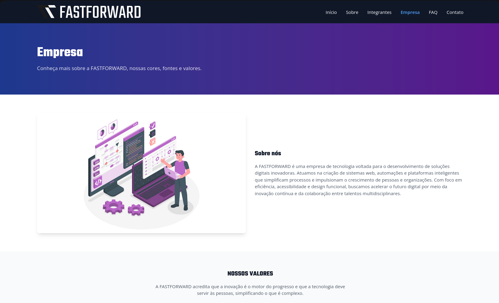
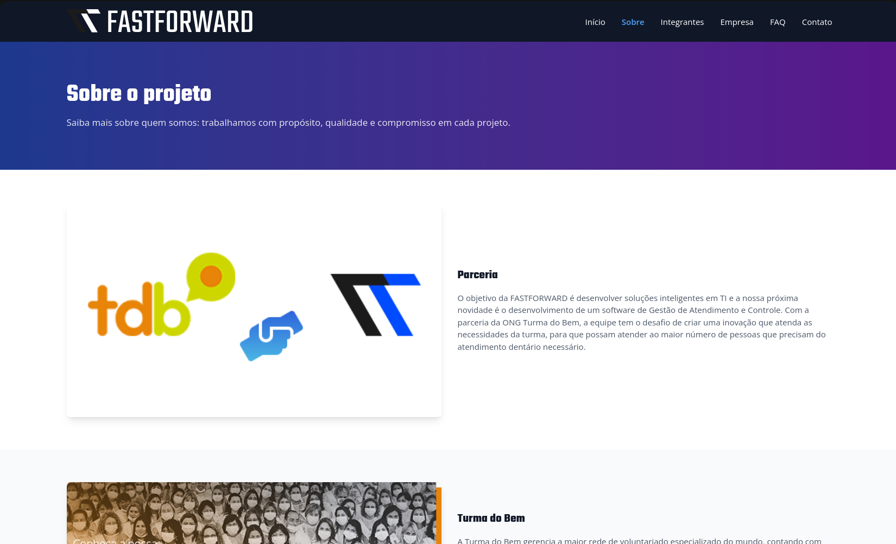
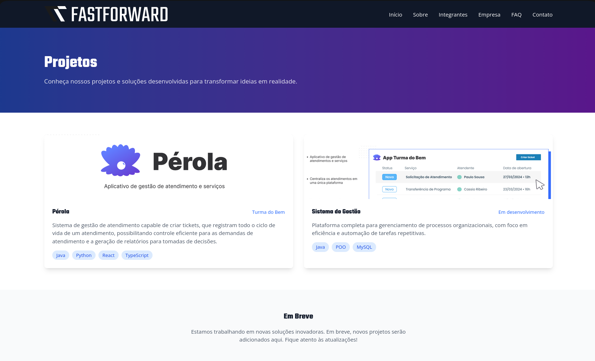

# FASTFORWARD - Projeto Pérola

Sistema de gestão de atendimento para a ONG Turma do Bem, desenvolvido como projeto acadêmico da disciplina de Front-End Design Engineering (FIAP).

## Descrição

O projeto Pérola é um sistema de gestão de atendimento capaz de criar tickets que registram todo o ciclo de vida de um atendimento, possibilitando controle eficiente para as demandas e a geração de relatórios para tomadas de decisões.

## Tecnologias

- **React** - Biblioteca JavaScript para construção de interfaces
- **Vite** - Build tool moderna e rápida
- **TypeScript** - Superset tipado de JavaScript
- **TailwindCSS** - Framework de estilização
- **React Router** - Navegação SPA
- **React Hook Form** - Gerenciamento de formulários

## Estrutura de Pastas

```
perola-front/
├── src/
│   ├── components/    # Componentes reutilizáveis
│   ├── pages/         # Páginas da aplicação (CRUD Beneficiários, etc)
│   ├── types/         # Interfaces TypeScript
│   ├── utils/         # Arquivos utilitários (ex: api.ts fetch)
│   ├── routes.tsx     # Roteamento central das páginas
│   ├── root.tsx       # Layout principal
│   └── index.css      # Estilos globais Tailwind
├── public/            # Imagens e assets estáticos
└── vercel.json        # Configuração p/ deploy (rewrites)
```

## Páginas

- **Home** (/) - Página inicial com overview do projeto
- **Sobre** (/sobre) - Informações sobre o projeto e parceria
- **Empresa** (/empresa) - Valores e identidade visual
- **FAQ** (/faq) - Perguntas frequentes
- **Contato** (/contato) - Formulário de contato (Validado com RHF)
- **Integrantes** (/integrantes) - Equipe do projeto
- **Projetos** (/projetos) - Projetos desenvolvidos
- **Beneficiários** (CRUD Sprint 4):
  - Listagem (`/admin`)
  - Criação (`/admin/novo`)
  - Detalhes (`/admin/:id` - Rotas dinâmicas API)

## Autores

<div align="center">

<!-- Integrante 1: Cassio -->

<h3>Cassio Ribeiro</h3>
<sub>RM 567295 - 1TDSPR</sub>
<p>20 anos de experiência na área tributária, descobriu na tecnologia uma paixão por resolução de problemas.</p>
<a href="https://www.linkedin.com/in/cassio-ribeiro-04223a46/" target="_blank">
  
</a>
<a href="https://github.com/cassio-ribeiro" target="_blank">
  
</a>

<br><br>

<!-- Integrante 2: Paulo -->

<h3>Paulo Sousa</h3>
<sub>RM 568580 - 1TDSPR</sub>
<p>O representante do grupo, Paulo é conhecido por sua habilidade em comunicação, liderança e trabalho em equipe.</p>
<a href="https://www.linkedin.com/in/paulo-sousa-b97235246/" target="_blank">
  
</a>
<a href="https://github.com/PauloSousaJDEV" target="_blank">
  
</a>

<br><br>

<!-- Integrante 3: Ruan -->

<h3>Ruan Silva</h3>
<sub>RM 566719 - 1TDSPB</sub>
<p>Startupeiro movido a café ☕ e muita melodia 🎵</p>
<a href="https://www.linkedin.com/in/silva-ruan" target="_blank">
  
</a>
<a href="https://github.com/ProgmRuanSilva" target="_blank">
  
</a>

</div>

## Como Usar

### Instalação

```bash
npm install
```

### Desenvolvimento

```bash
npm run dev
```

A aplicação estará disponível em `http://localhost:5173`

### Build

```bash
npm run build
```

### TypeScript

```bash
npm run typecheck
```

## Imagens do Projeto





## Entrega - Sprints 3 e 4

- **Deploy Vercel:** [https://perola-front.vercel.app/](https://perola-front.vercel.app/)
- **Vídeo Pitch (YouTube):** [https://youtu.be/V0IOCo6VWnA](https://youtu.be/V0IOCo6VWnA)
- **Repositório GitHub:** [https://github.com/ProgmRuanSilva/perola-front](https://github.com/ProgmRuanSilva/perola-front)

---

Desenvolvido com ❤️ por FASTFORWARD - 1TDSPR - FIAP 2026
